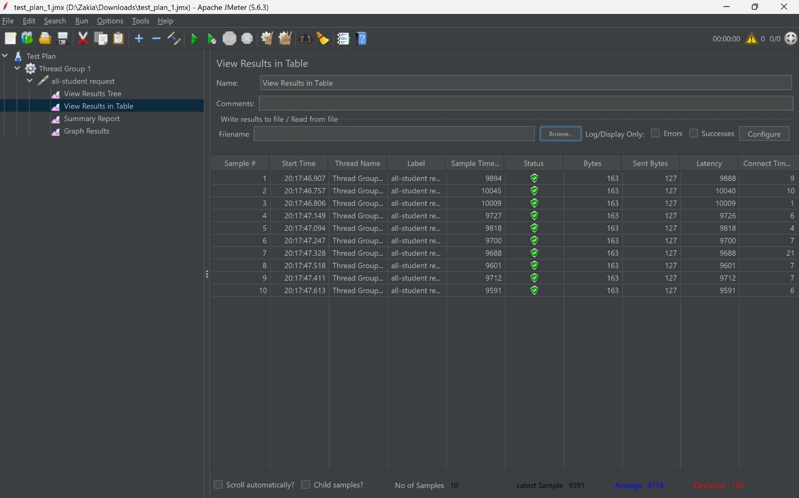
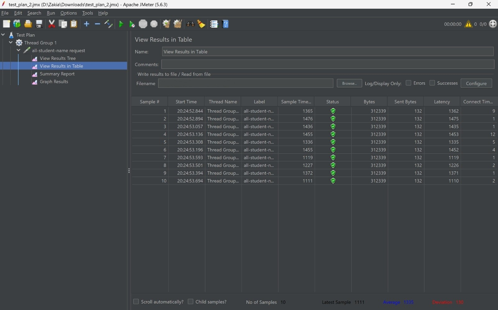
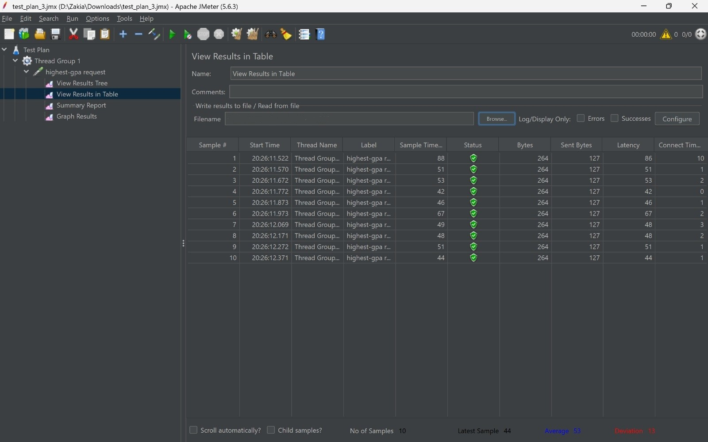
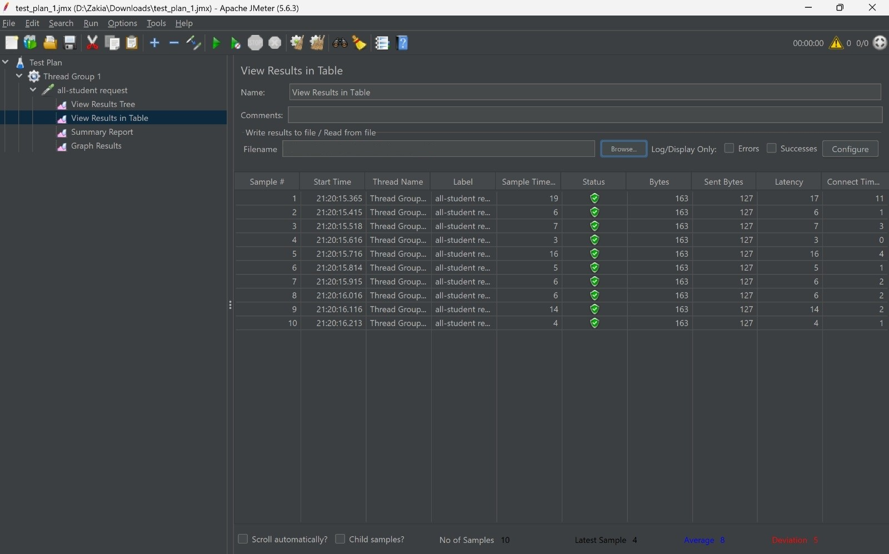
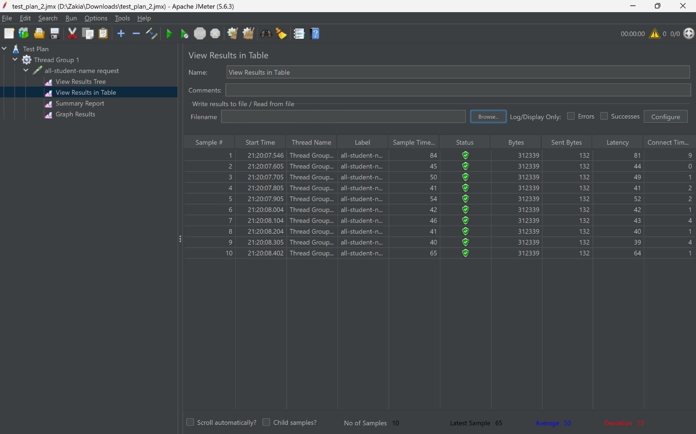
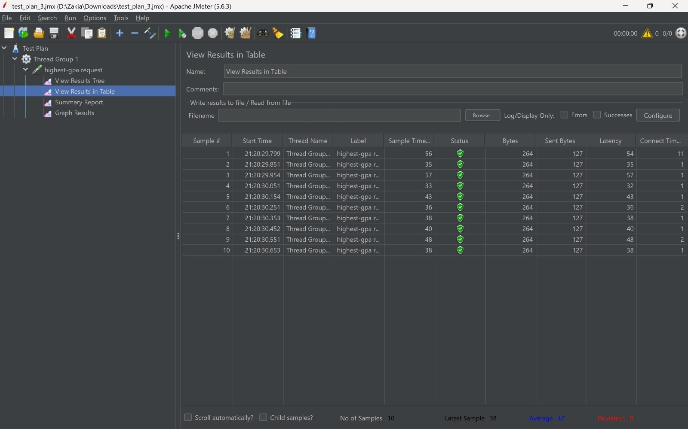

## JMeter Test Before Optimization
- /all-student :
  

- /all-student-name :
  

- /highest-gpa :
  

## JMeter Test After Optimization
- /all-student :
  

- /all-student-name :
  

- /highest-gpa :
  

## Conclusion
Dari hasil perbandingan menggunakan JMeter, terdapat peningkatan performa pada Sample Time. Optimasi ini dicapai dengan membereskan masalah N+1 Query pada Spring Data JPA dan memperbaiki efisiensi memori dengan menggunakan StringBuilder dibanding melakukan penggabungan String biasa.

## Reflection Answers
1. What is the difference between the approach of performance testing with JMeter and profiling with IntelliJ Profiler in the context of optimizing application performance?
JMeter digunakan untuk performance testing dari sisi user, yaitu mengukur throughput, latency, dan waktu respons API saat aplikasi diberi beban. Sedangkan IntelliJ Profiler digunakan untuk analisis mikro dari sisi internal aplikasi, seperti mengecek penggunaan CPU, alokasi memori, dan waktu eksekusi per method untuk mencari fungsi mana yang memakan resource paling banyak.

2. How does the profiling process help you in identifying and understanding the weak points in your application?
Proses profiling sangat membantu karena menampilkan metrik yang detail seperti Call Trees dan CPU time per method. Jadi tidak perlu nebak lagi dimana bottleneck nya dan bisa langsung fokus memperbaiki baris kode yang spesifik.

3. Do you think IntelliJ Profiler is effective in assisting you to analyze and identify bottlenecks in your application code?
Menurut saya sangat efektif karena sudah terintegrasi langsung dengan IDE. Kita bisa langsung melihat detail waktu eksekusi tiap method sehingga lokalisasi bottleneck bisa dilakukan dengan cepat.

4. What are the main challenges you face when conducting performance testing and profiling, and how do you overcome these challenges?
Tantangan utamanya adalah hasil pengukuran yang kadang fluktuatif karena proses pemanasan kompiler JIT dari JVM atau faktor dari OS di background. Solusinya adalah menjalankan API beberapa kali dan mengambil nilai rata-rata eksekusi daripada hanya mengandalkan hasil run yang pertama.

5. What are the main benefits you gain from using IntelliJ Profiler for profiling your application code?
Keuntungan utamanya adalah bisa melihat transparansi proses di dalam aplikasi. Jadi bisa membedakan mana lambat yang disebabkan oleh proses I/O dan mana yang disebabkan oleh komputasi CPU.

6. How do you handle situations where the results from profiling with IntelliJ Profiler are not entirely consistent with findings from performance testing using JMeter?
Jika terjadi inkonsistensi, biasanya itu karena faktor eksternal di luar kode, misalnya masalah jaringan, limitasi hardware klien, atau konfigurasi Tomcat/Hikari. Cara mengatasinya adalah dengan mengecek metrik infrastruktur dan log server untuk melihat gambaran yang lebih lengkap, tidak hanya fokus pada analisis method kodenya saja.

7. What strategies do you implement in optimizing application code after analyzing results from performance testing and profiling? How do you ensure the changes you make do not affect the application's functionality?
Strategi yang diterapkan pada refactoring struktur kode adalah menyelesaikan masalah N+1 query dan menggunakan cara yang lebih efisien seperti StringBuilder. Memastikan  perubahannya hanya berfokus pada efisiensi tanpa menambahkan fitur di luar fungsi awal method tersebut.